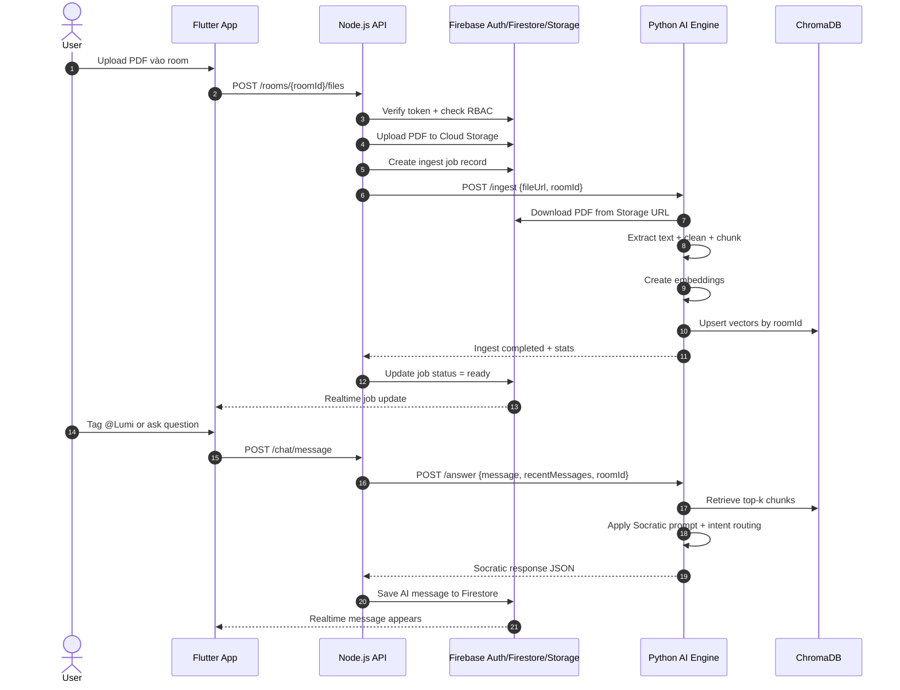

# TECH-ARCHITECTURE - LUMI AI MVP

## 1. Mục tiêu kiến trúc

Mục tiêu của bản MVP là giữ hệ thống đủ nhỏ để một solo developer có thể tự setup, debug và maintain lâu dài. Vì vậy kiến trúc nên ưu tiên:

- Ít service, ít điểm lỗi, ít hạ tầng phải vận hành.
- Ranh giới trách nhiệm rõ giữa UI, API gateway và AI Engine.
- Tận dụng dịch vụ managed cho phần tốn công vận hành như Auth, Realtime và File Storage.
- Chỉ dùng local vector store cho MVP, chưa triển khai cluster hay hạ tầng vector tách riêng.

## 2. Kiến trúc tối giản đề xuất

### 2.1. Frontend

- **Flutter** cho mobile/web.
- Trách nhiệm:
  - Đăng nhập, điều hướng, hiển thị chat 1-1 và chat nhóm.
  - Render LaTeX bằng KaTeX hoặc MathJax wrapper.
  - Upload PDF, hiển thị trạng thái xử lý, stream kết quả hội thoại.

### 2.2. Backend API & Realtime

- **Node.js + Express** làm API gateway.
- **Firebase Auth** cho xác thực.
- **Firestore** cho realtime chat, membership, room metadata.
- **Cloud Storage** cho file PDF.
- Trách nhiệm:
  - Xác thực request từ Flutter.
  - Enforce RBAC và kiểm tra quyền room.
  - Ghi nhận message, file metadata, job status.
  - Gọi AI Engine khi có sự kiện cần xử lý Socratic.

### 2.3. AI Engine

- **Python + FastAPI** là lựa chọn tối giản hơn Flask cho API async và tài liệu OpenAPI tự sinh.
- Trách nhiệm:
  - Ingest PDF, chunking, embedding, truy vấn vector store.
  - Intent routing để quyết định trả lời trực tiếp hay Socratic.
  - Sinh câu trả lời gợi mở dựa trên system prompt và context.
  - Trả về response có cấu trúc để Node.js ghi vào Firestore.

### 2.4. Vector Store

- **ChromaDB** dạng persistent local cho MVP.
- Lý do chọn:
  - Dễ setup nhất cho solo dev.
  - Không cần quản trị service riêng.
  - Phù hợp các workspace nhỏ và dữ liệu PDF vừa phải.

## 3. Giao tiếp giữa 3 module

### 3.1. Flutter -> Node.js

Flutter không gọi AI Engine trực tiếp trong MVP. Tất cả request đi qua Node.js để giữ RBAC, logging và realtime consistency.

**Ví dụ request**:

```json
{
  "roomId": "room_123",
  "message": "@Lumi giúp mình hướng đi bài này",
  "contextMessageIds": ["m1", "m2", "m3"],
  "attachmentIds": ["pdf_01"]
}
```

### 3.2. Node.js -> AI Engine

Node.js gửi sang AI Engine qua REST API nội bộ.

**Payload tối thiểu**:

```json
{
  "roomId": "room_123",
  "userId": "u_01",
  "message": "@Lumi giúp mình hướng đi bài này",
  "recentMessages": [],
  "knowledgeBaseScope": "room",
  "retrievalTopK": 5
}
```

AI Engine trả về:

```json
{
  "mode": "socratic",
  "answer": "Bạn đã thử áp dụng điều kiện biên vào phương trình chưa?",
  "citations": ["doc_3#chunk_12"],
  "usedDocuments": ["doc_3"]
}
```

### 3.3. AI Engine -> Node.js

AI Engine không ghi trực tiếp vào Firestore trong MVP. Nó chỉ trả JSON response. Node.js sẽ:

- Lưu message AI vào Firestore.
- Cập nhật job status.
- Trigger realtime update cho Flutter.

## 4. Luồng xử lý dữ liệu

### 4.1. Luồng upload PDF

1. User upload PDF từ Flutter.
2. Flutter gửi file lên Node.js.
3. Node.js xác thực quyền room và đẩy file lên Cloud Storage.
4. Node.js tạo record ingest job trong Firestore.
5. Node.js gọi AI Engine endpoint ingest.
6. AI Engine tải file từ Storage, parse text, chunk, embedding.
7. AI Engine lưu vectors vào ChromaDB theo `roomId` hoặc `userId`.
8. AI Engine trả job status về Node.js.
9. Node.js cập nhật Firestore để Flutter thấy trạng thái hoàn tất.

## 5. Sequence diagram: PDF -> Chunking -> Vector DB -> Socratic Response



## 6. Giải pháp tối giản để một người có thể setup và maintain

### 6.1. Cấu trúc repo khuyến nghị

- `apps/flutter-app`
- `services/node-api`
- `services/ai-engine`
- `docs`
- `infra` nếu cần docker compose hoặc script setup

### 6.2. Nguyên tắc vận hành

- Chỉ có 1 backend gateway duy nhất là Node.js.
- Chỉ có 1 AI service duy nhất là Python.
- Dùng Firebase cho phần khó tự xây như Auth, realtime, file storage.
- Chỉ dùng ChromaDB persistent local để tránh chi phí và công vận hành.
- Tất cả contract giữa service phải là JSON rõ ràng, có version.

### 6.3. Stack khuyến nghị cho MVP

- **Flutter**: giao diện đa nền tảng.
- **firebase_auth / cloud_firestore / firebase_storage**: auth, realtime, file.
- **Express** hoặc **Fastify**: nếu muốn nhẹ hơn Express thì có thể chọn Fastify, nhưng Express dễ phổ biến hơn cho solo dev.
- **FastAPI**: AI Engine.
- **LangChain** hoặc pipeline tự viết đơn giản: nếu cần giảm phụ thuộc, ưu tiên tự viết pipeline ingest + retrieval ở mức tối thiểu.
- **ChromaDB**: vector store local.
- **pypdf** hoặc **pdfplumber**: đọc PDF.
- **sentence-transformers** hoặc embedding API từ LLM provider: tạo embedding.

## 7. Lộ trình triển khai kỹ thuật khuyến nghị

1. Dựng Firebase Auth + Firestore + Storage trước.
2. Dựng Node.js API với các endpoint auth, room, message, upload.
3. Dựng AI Engine ingest + retrieval + answer.
4. Dựng Flutter UI với chat, upload, render LaTeX.
5. Sau cùng mới tối ưu caching, observability và prompt tuning.
